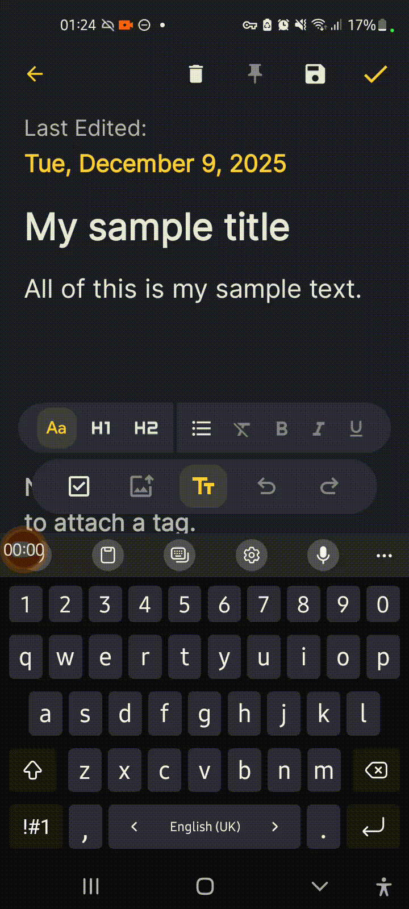
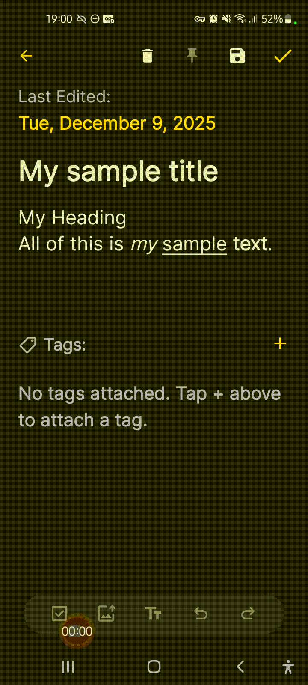
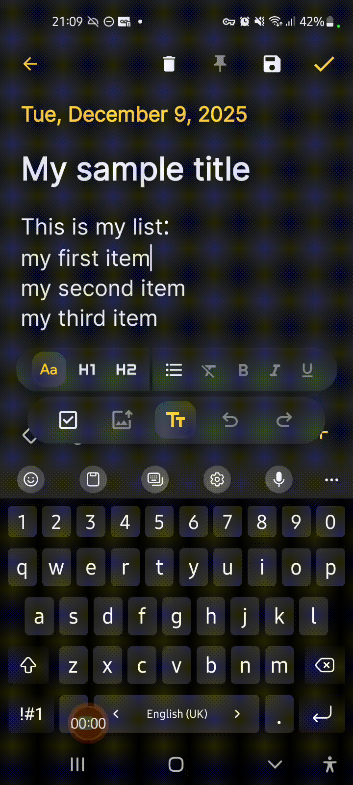
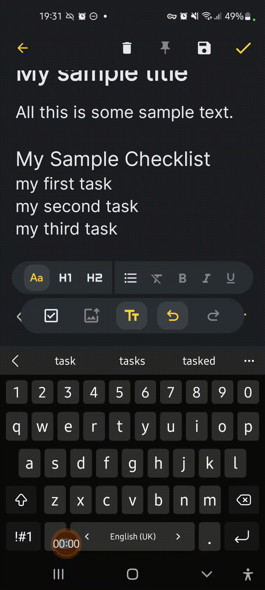
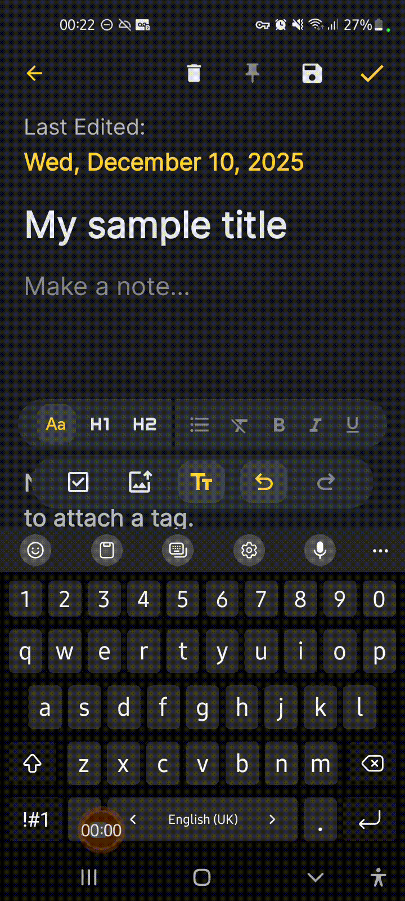
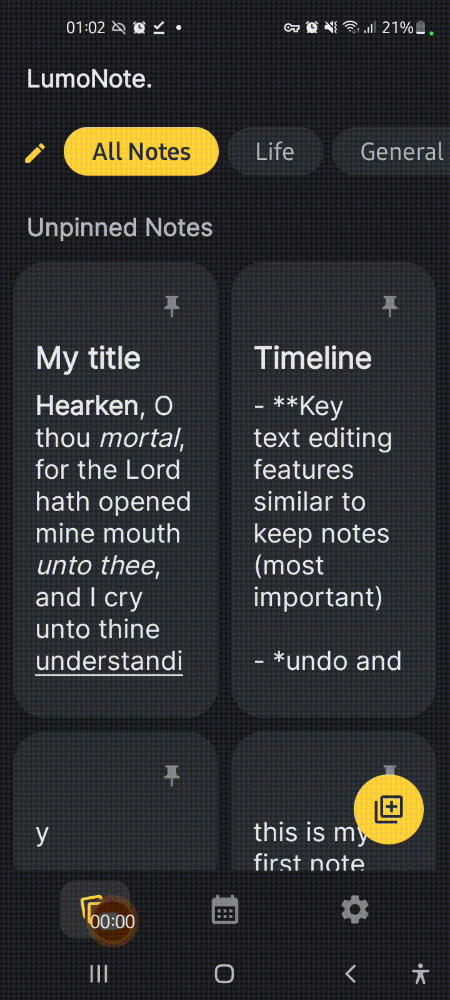
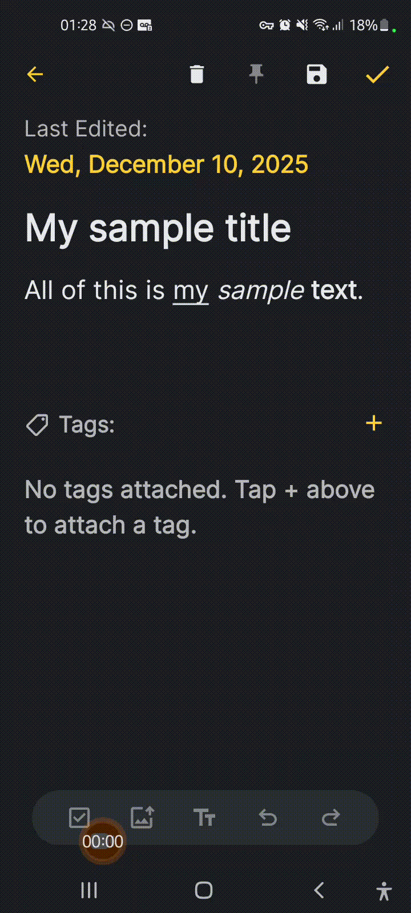

# LumoNote  

✨ **Illuminate your thoughts, to-dos, and ideas with LumoNote.** ✨ 

LumoNote combines key features from your favorite note-taking apps like Google Keep into a simple lightweight experience.  

---

## Current Features
- 📝 Add Text Formatting (**Bold**, *Italics*, Underline)  




- 🅰️ Change Header Sizes




- 📒 Add Normal & Custom Bullets




- 🖼️ Add an Image


- ☑️ Add To-Do Checklists  




- ↩️ Undo & Redo Changes




- 📌 Pin Notes  




- 🏷 Tag Notes  




(All features subject to change as the application evolves and is further optimised!)

---

## Install  
(apk download available soon!)

1. Download the `LumoNote.apk` file from the main folder above  
2. Open it on your Android device  
3. Tap **Install**  
4. Enjoy!   

---

## Build from Source  
If you’d like to try running or modifying LumoNote yourself:  

- Download the project or Clone it using the command below
```bash
git clone https://github.com/curioskye-studios/LumoNote.git

- Open in Android Studio
